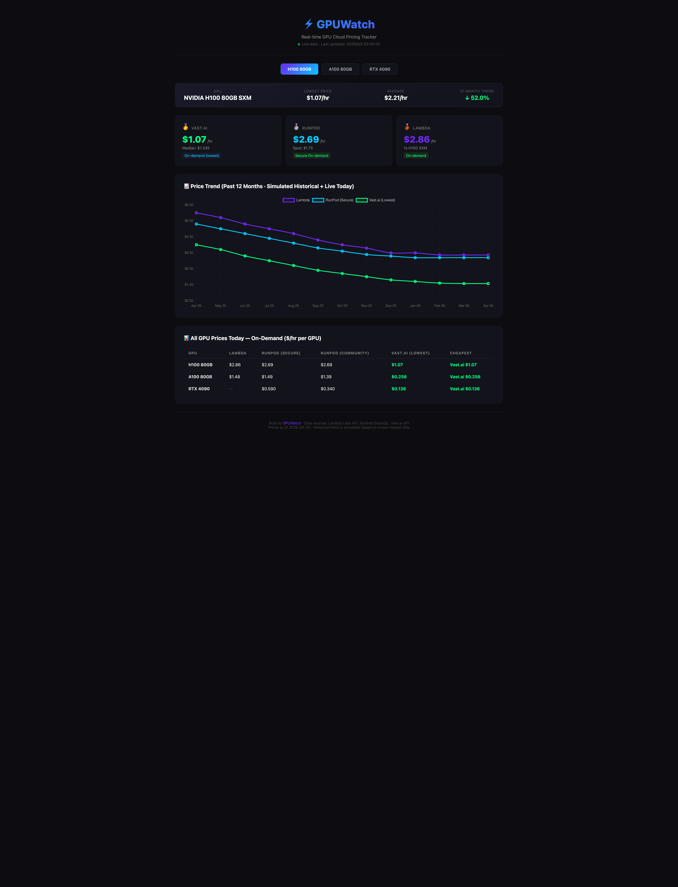

# GPUWatch Price Dashboard

A single-page real-time GPU cloud pricing comparison dashboard.

## Features

- **3 GPU models**: H100 80GB, A100 80GB, RTX 4090
- **3 providers**: Lambda Labs, RunPod, Vast.ai
- **Live API data** from:
  - RunPod GraphQL API (public, no key needed)
  - Vast.ai REST API (public, no key needed)
  - Lambda via ComputePrices/Shadeform aggregator
- **12-month price trend** chart (simulated historical + live endpoint)
- **Zero dependencies** — single HTML file, opens in any browser

## Usage

```bash
# Just open it
open dashboard/index.html

# Or serve locally
python3 -m http.server 8765
# Then visit http://localhost:8765/dashboard/
```

## Data Sources & APIs

### RunPod (free, public)
```bash
curl -s "https://api.runpod.io/graphql" \
  -H "Content-Type: application/json" \
  -d '{"query":"{gpuTypes{id displayName memoryInGb securePrice communityPrice secureSpotPrice communitySpotPrice}}"}'
```

### Vast.ai (free, public)
```bash
curl -s "https://cloud.vast.ai/api/v0/bundles/" -G \
  --data-urlencode 'q={"gpu_name":"H100 SXM","order":[["dph_total","asc"]],"type":"on-demand","limit":5}'
```

### Lambda Labs
- Requires API key for direct access
- Alternative: scrape via ComputePrices.com structured data

## Next Steps

- [ ] Add cron job to collect daily price data
- [ ] Replace simulated history with real historical data
- [ ] Deploy to GitHub Pages / Vercel
- [ ] Add more providers (CoreWeave, Vultr, DataCrunch)
- [ ] Add Spot price tracking
- [ ] Price alert notifications

## Screenshot


